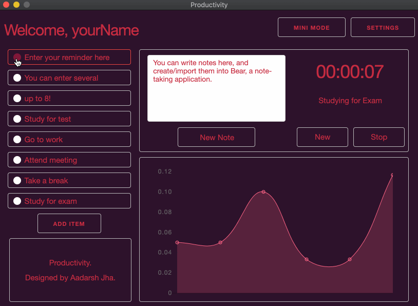
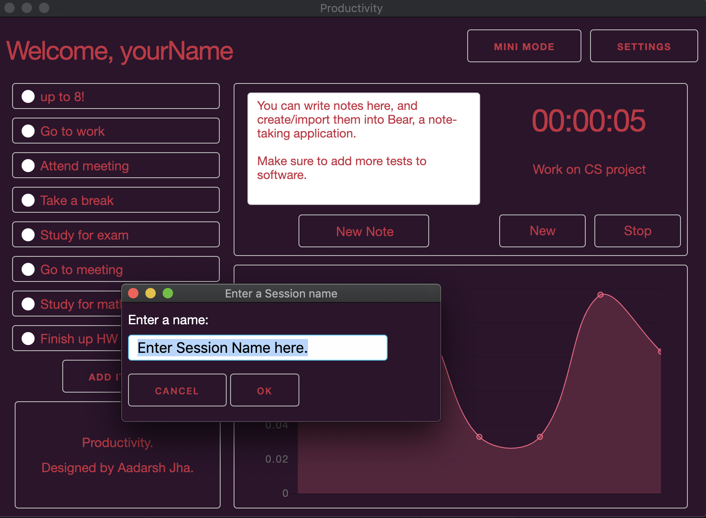
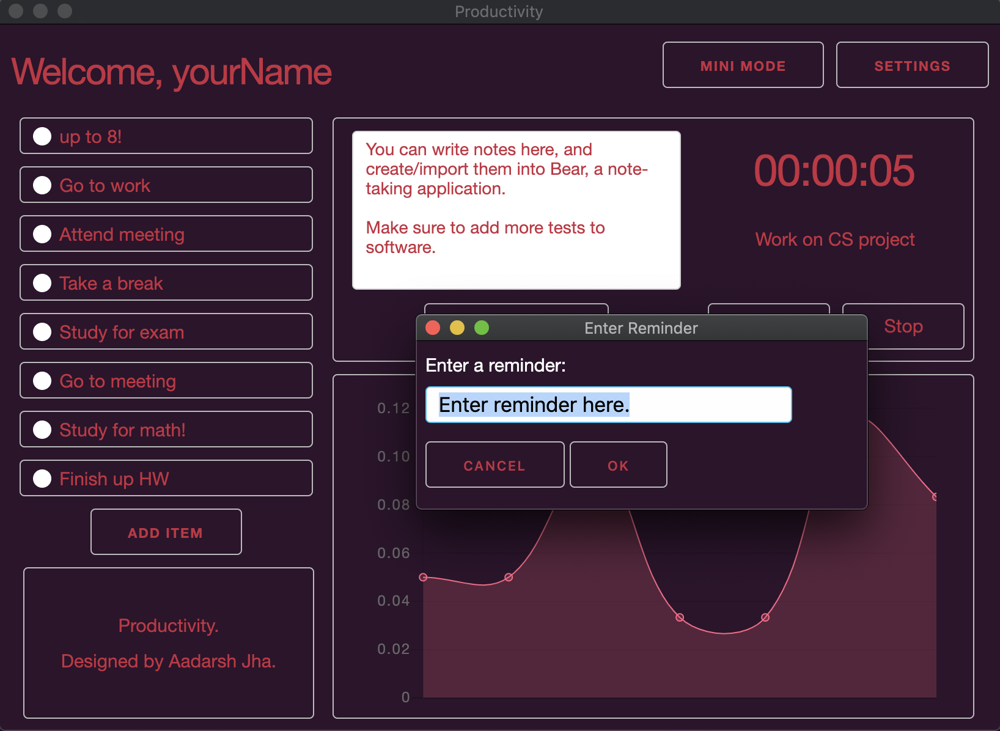
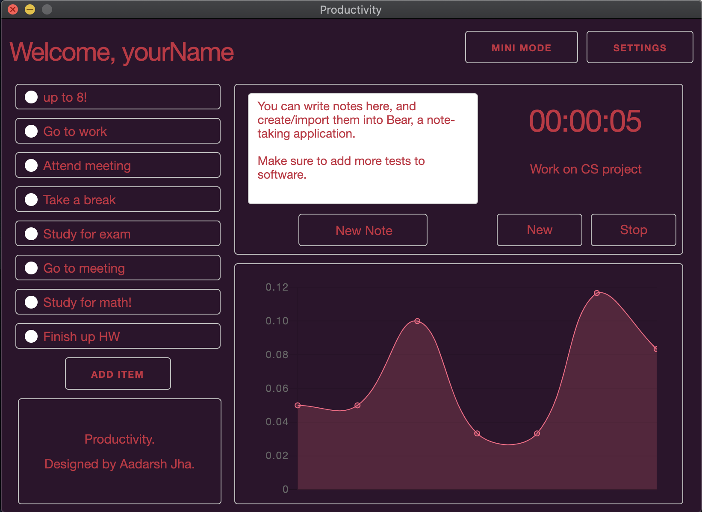

# Productivity. 

### What is Productivity? 

Productivity is a native Desktop application that serves as a dashboard for productive widgets to increase effeciency in your workflow. Productivity is made from HTML, CSS, JavaScript, as well as Node.js.

Productivity uses the Electron.js Framework and runs on the Chromium / Node.js engine that Electron supplies. Productivity also allows for data persistence through the storage of your critical data in the App Data portion of your system (stored in JSON format). 

Productivity also utilizes several packages from `NPM`, including Chart, Timer, and CSS boilderplates. 

### How is it used? 

 

The goal of its usage is to act as a central hub of critical widgets that are needed to stay on-track. The below GIF demonstrates its functionality at a high-level.  

There are several aspects to the application: 

* The `TODO` list: The `TODO` list allows for up to eight reminders so you can stay focused on the most critical activities. The list allows for items to be deleted, added, and edited. When editing items, a prompt will be displayed so as to allow for a message to be entered.
* The `Notetaker`: This aspect of the application utilizes Apple's `x-callback-url` feature to incorporate and create notes into an application called Bear, a simple, markdown based notetaker.
* The `Sessions` Clock: This portion of the application is unique in that it allows for the user to time themselves on certain critical tasks that may be taxing or lengthy. This allows for the user to be aware of how much time there are taking generally on distinct tasks that are needed to be completed.
* The `Chart`: The `Chart` allows for each `Session` to be recorded in a nice UI/scatterplot. THe user can also hover over the data points to get more information to understand their progress on these certain tasks. 

The easiest way I can think of solving this is using the tables included in GitHub's flavored markdown.

To your specific example it would look something like this:

Enter a session state           |  Enter a reminder state
:-------------------------:|:-------------------------:
  |  

### General UI Design 

